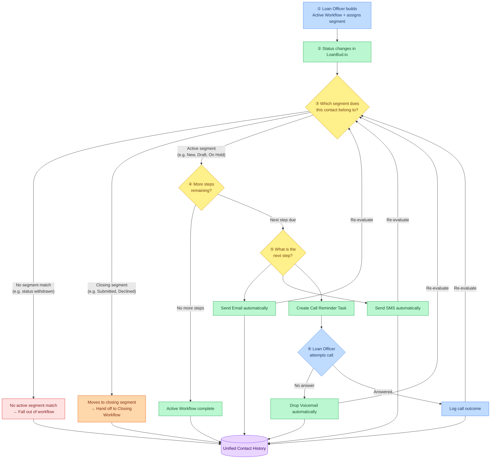
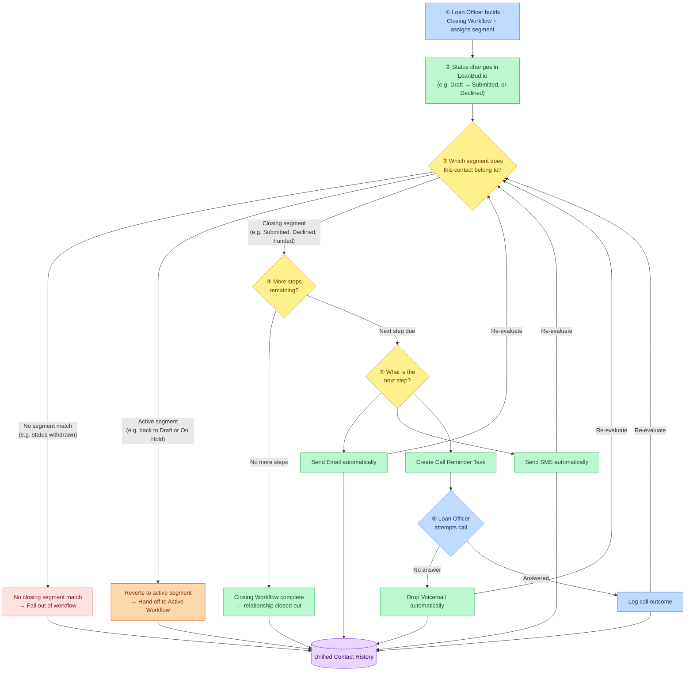
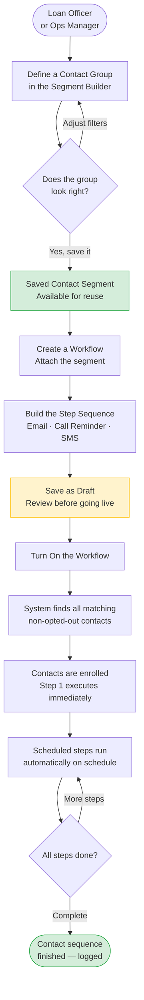
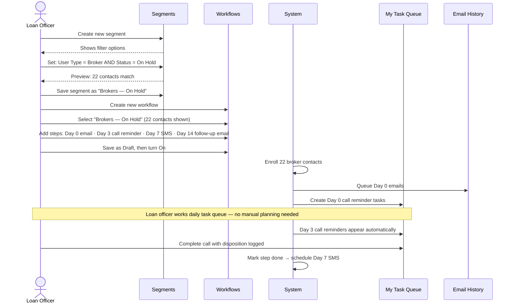
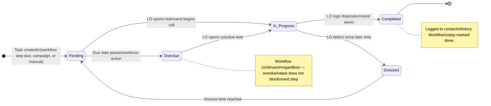
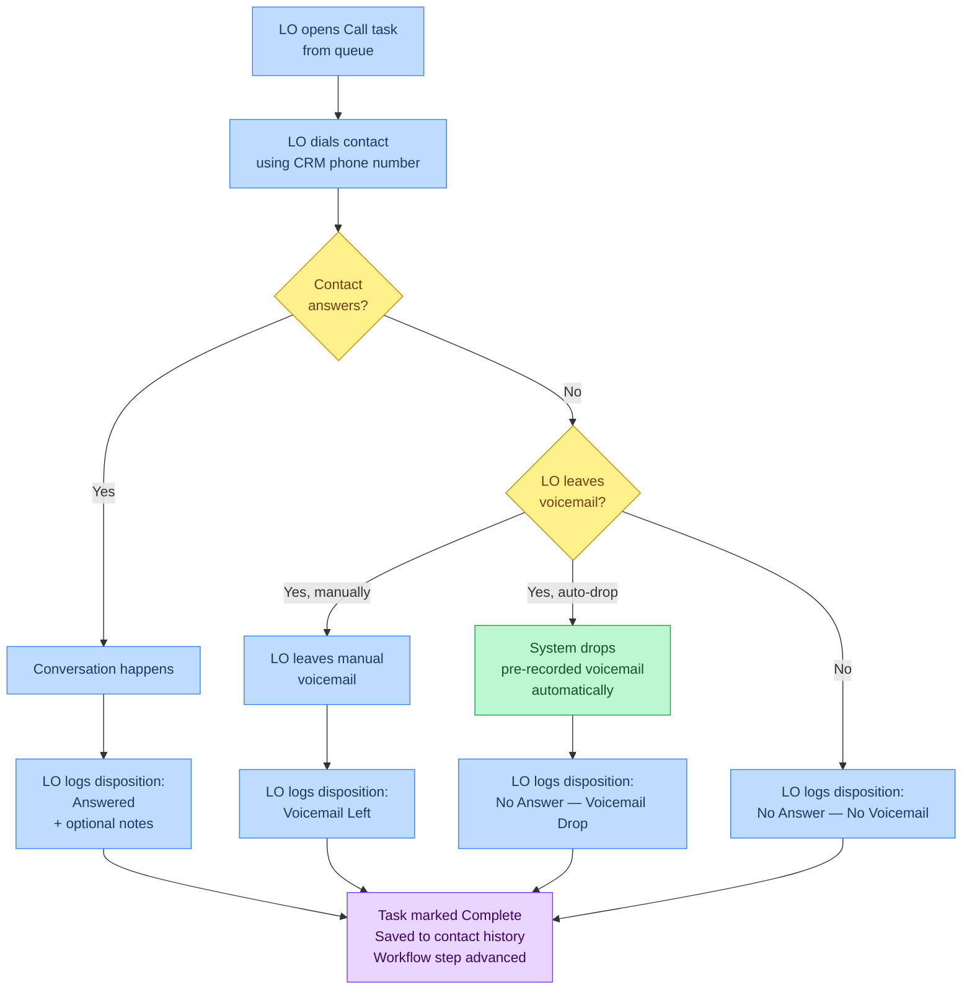
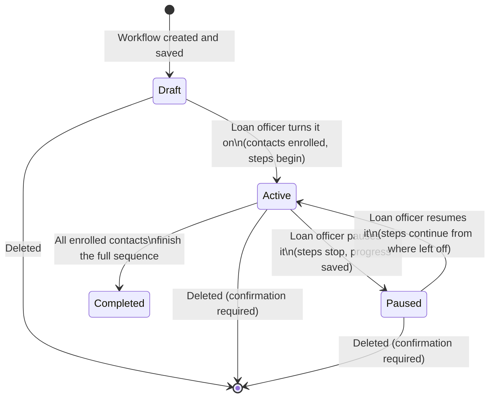
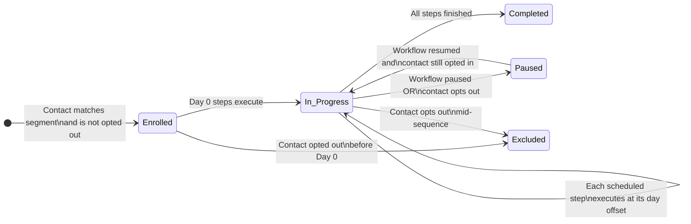
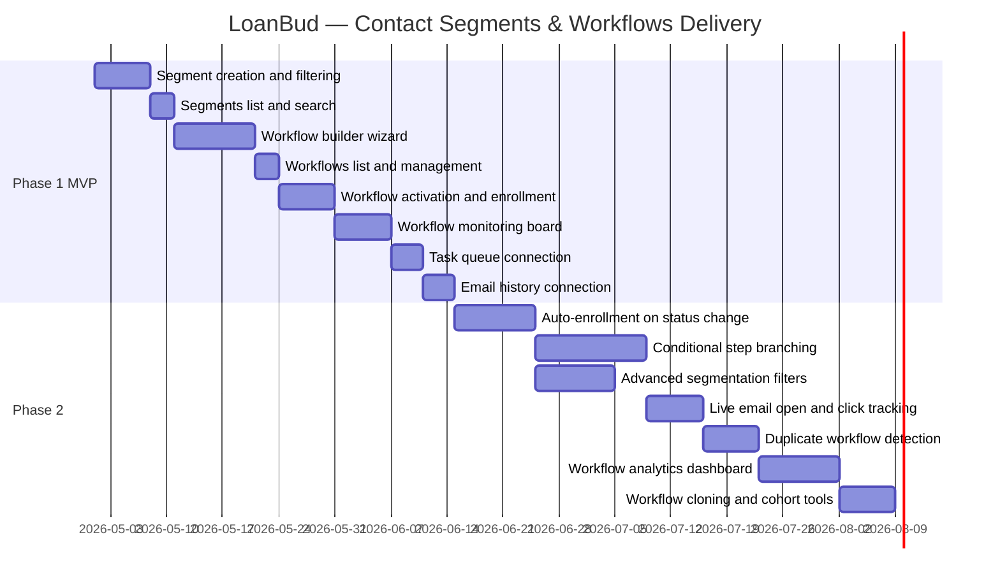

# Product Requirements Document
## LoanBud CRM — Contact Segments & Automated Workflows

---

## Overview

LoanBud.io is a lending platform that manages broker and seller loan applications through a defined set of listing statuses: **New → Draft → Submitted → Under Review**, with additional states for On Hold and Declined. Each status transition represents a meaningful moment in the borrower relationship — a moment that should trigger the right communication, the right loan officer action, and the right record in the contact's history.

Today, those moments go largely unmanaged. LoanBud.io handles the listing itself, but the outreach, follow-up, and activity logging that should happen alongside each status change is left to individual loan officers to figure out on their own. The result is a disconnected process: status changes happen in LoanBud.io, outreach happens (or doesn't) in personal email and phone apps, and nothing is recorded in a shared, auditable history.

**The core principle of this initiative is that LoanBud.io is the source of truth for listing status — and the CRM should be the source of truth for every action taken in response to that status.** The goal is one connected workflow, not two separate systems operating in isolation.

### Goals

1. **Connect listing status to outreach.** Every time a broker or seller's listing status changes in LoanBud.io, the CRM should automatically trigger the right combination of outbound email, SMS, voicemail drop, loan officer task, and activity log entry — with no manual coordination required.

2. **Give each loan officer a clear, prioritized work queue.** When a listing enters Draft status, the assigned loan officer should immediately receive a structured three-week outreach plan — specific calls to make, messages to send, and reminders to follow up — without having to build that plan themselves.

3. **Enforce the right channel at the right time.** Not all communication channels are appropriate at every stage. Contacts in New status have not yet provided SMS opt-in, so no texts should be sent. Contacts in Draft status can receive SMS and voicemail drops where authorization exists. The CRM should enforce these rules automatically so loan officers never accidentally send an unauthorized message.

4. **Create a single, unified contact history.** Every email sent by LoanBud.io, every outbound call logged by a loan officer, every SMS, voicemail drop, and task completion should appear in one chronological record per contact. This history is the foundation for both day-to-day relationship management and compliance reporting.

5. **Make outreach auditable without extra work.** Operations managers and compliance reviewers should be able to open any contact record and immediately see a full, timestamped account of every touchpoint — across automated emails, manual calls, and CRM-initiated SMS — without asking anyone to reconstruct it.

6. **Scale the team's capacity without scaling headcount.** Automating the communication sequences that currently require constant manual attention allows each loan officer to handle a larger book of contacts without sacrificing follow-up quality.

### How It Works at a Glance

> **Legend:** 🟦 Manual step (person acts) &nbsp;|&nbsp; 🟩 Automated step (system acts) &nbsp;|&nbsp; 🟨 Decision (system checks)

**Diagram A — Active Workflow** (e.g. Draft-stage 3-week pursuit for New, Draft, On Hold contacts)



---

**Diagram B — Closing Workflow** (e.g. post-submission acknowledgment or post-decline relationship closure)



| Color | Meaning |
|---|---|
| 🔵 Blue | **Manual** — a person configures or acts |
| 🟢 Green | **Automated** — the system executes without intervention |
| 🟡 Yellow | **Decision** — the system evaluates a condition |
| 🔴 Red | **Exit** — contact falls out (no matching segment) |
| 🟠 Orange | **Hand-off** — contact moves to the other workflow type |
| 🟣 Purple | **Output** — the unified record of everything that happened |

---

## 1. Document Control

| | |
|---|---|
| **Product Area** | LoanBud CRM – Contact Segments & Automated Workflows |
| **Author** | [Author Name] |
| **Stakeholders** | Head of Product, Engineering Lead, Loan Operations Manager, Compliance Officer, QA Lead, Marketing |
| **Status** | Draft |

**Version History**
- v0.1 – [Add date] – Initial draft – [Add owner]
- v1.0 – [Add date] – Approved – [Add owner]

---

## 2. The Problem We're Solving

Every day, loan officers at LoanBud manage hundreds of contacts — brokers, lenders, and partners — all at different stages of the loan process. Right now, deciding who to reach out to, when to reach out, and what to say is entirely up to each individual loan officer. There is no shared system to support this work, which creates three real problems:

**The right people aren't getting timely attention.**
There is no structured way to group contacts by where they are in the loan process. If a loan officer wants to follow up with every broker whose application is on hold, they have to scroll through their contact list and figure it out themselves. Contacts who need urgent follow-up get missed. Contacts who have already been handled get contacted again unnecessarily.

**Follow-up is inconsistent — and often forgotten.**
After an initial email or call, there is no system to make sure the right follow-up happens on the right day. Reminders live in personal calendars or sticky notes. Some contacts receive consistent, timely attention. Others fall through the cracks entirely — depending on which loan officer is handling their account on a given week.

**There's no way to audit what actually happened.**
When a manager wants to know whether a group of contacts has been properly followed up, or when a compliance review asks for a full record of outreach to a specific person, there is no reliable answer. Each loan officer tracks things differently, and reconstructing a contact's communication history can take an hour or more of manual effort.

**Two systems, no connection.**
LoanBud.io and the CRM currently operate independently. When a listing moves from New to Draft in LoanBud.io, the CRM does not know. The loan officer does not automatically receive a task. No outreach sequence starts. No activity is logged. The status change — which represents a real event requiring real action — disappears into the gap between the two systems.

**Who is affected:** Loan officers carry the daily burden. Operations managers have no visibility. Business development reps can't run systematic partner outreach. And ultimately, borrowers and partners receive an inconsistent experience.

**Why this matters now:** As LoanBud's contact list and loan pipeline grow, manually managing outreach doesn't scale. Without this tooling, deal drop-off will increase, compliance exposure will grow, and onboarding new loan officers will remain slow and inconsistent.

---

## 3. What We're Building and Why

We are introducing two connected capabilities that together solve the problems above:

**Contact Segments** let loan officers and operations managers group contacts into named lists based on shared characteristics — for example, "All broker contacts with applications currently on hold" or "All new lender contacts who haven't submitted anything yet." These groups are saved and reusable, so teams define an audience once and use it everywhere.

**Automated Workflows** let users build a sequence of communication steps — an email on Day 1, a call reminder on Day 3, an SMS check-in on Day 7 — and attach that sequence to a saved contact group. Once a workflow is turned on, the system automatically enrolls every contact in the group, sends the right message on the right day, and creates a task for the loan officer when a personal call is needed.

**How the two work together:** A loan officer creates a contact segment targeting on-hold broker applications. They attach a two-week follow-up workflow to that segment. The system handles the rest: it finds the right contacts, delivers scheduled emails and texts, reminds the loan officer when to call, and keeps a full log of everything that happened. The loan officer works from a clear daily task list instead of making decisions about who to contact from scratch every morning.

**How LoanBud.io fits in:** LoanBud.io remains the authoritative record for listing status. The CRM receives status updates from LoanBud.io and uses them as the trigger for the right workflow — ensuring that emails, tasks, and SMS messages sent from the CRM always reflect what is actually happening in the loan pipeline. Emails generated by LoanBud.io itself (such as submission confirmations and status alert emails) are also surfaced in the CRM's unified contact history, so the loan officer sees the full picture in one place regardless of which system sent the message.

### What success looks like

- A listing status change in LoanBud.io automatically triggers the right outreach sequence in the CRM — no manual handoff required.
- Loan officers spend less time deciding who to contact and more time actually contacting them.
- Every contact in a follow-up sequence receives all scheduled touchpoints — nothing falls through the cracks.
- No SMS or voicemail drop is ever sent to a contact who hasn't authorized it.
- Operations managers can review the full outreach history for any contact in minutes, not hours.
- The team's outreach process is consistent and auditable regardless of which loan officer is handling an account.

---

## 4. What Is Not Included in This Release

We are keeping the first release focused. The following are explicitly out of scope and will be addressed later:

**Contact Segments — not in this release:**
- Filtering contacts based on behavioral history (e.g., whether they opened an email, how many days since last contact, or what their loan amount is)
- Restricting who can view or edit specific segments based on team role

**Workflows — not in this release:**
- Branching paths within a workflow based on what a contact did (e.g., "if they opened the email, send a follow-up; if not, make a call instead")
- Automatically starting a workflow when a contact's listing status changes in LoanBud.io — in this release, loan officers manually activate workflows against a saved segment; real-time status-change triggers are Phase 2
- Automatically stopping a Draft-stage workflow when a contact's status advances to Submitted — loan officers manually pause or remove contacts; automated stop-on-status-change is Phase 2
- Testing two versions of the same email against each other to see which performs better
- Preventing two separate workflows from sending to the same contact simultaneously

**Channels and integrations — not in this release:**
- Reading replies to emails or text messages back into the system
- Live tracking of whether an email was opened or a link was clicked (tracking will be added in a later phase)
- Connecting to external CRM systems, phone dialers, or marketing platforms

---

## 5. Demo

| | |
|---|---|
| **Demo link** | https://demo-placeholder.example/link |
| **Recording date** | [Add date] |
| **Version** | [Describe the product version or build shown] |
| **Notes** | Summarize what is demonstrated, any gaps versus the current scope, and key callouts for reviewers. |

---

### 2-Minute Demo Walkthrough Script

> **⚠️ Prototype note:** This is a front-end demo prototype. All data shown is sample/seed data only. No real contacts exist in this system. No emails, SMS messages, or voicemail drops are actually sent during this walkthrough. All workflow step executions, task creations, and history entries shown are simulated UI interactions for demonstration purposes only.

> **Format:** Narrated user flow — read each line as you perform the action on screen. Total runtime: ~2:00.

---

#### **[0:00 – 0:12] — Scene Setting**

**Screen:** Land on the CRM Contacts list. Scroll slowly through the contact rows — a mix of brokers and lenders at different listing statuses (New, Draft, On Hold).

> *"Meet Marcus — a senior loan officer at LoanBud. He's managing over 200 contacts right now. Every morning he has to figure out: who needs a follow-up call today? Who's stuck on hold? Who submitted their documents and needs a thank-you? Right now, that answer lives entirely in his head. We're about to change that."*

---

#### **[0:12 – 0:32] — Step 1: Define the Audience (Segments)**

**Screen:** Click **"Segments"** in the left sidebar. The Segments list loads — a few example segments are already visible (seed data).

> *"The first thing Marcus does is define his audience. He goes to Segments — this is where he tells the system exactly who he wants to reach out to."*

**Action:** Click **"New Segment."** The Segment Builder opens.

> *"He creates a new segment. He'll call it — "*

**Action:** Type into the name field: **"Brokers — On Hold Applications"**

> *"— and now he sets the rules for who belongs in it."*

**Action:** In the filter rules section, add Rule 1: field = **User Type**, condition = **is**, value = **Broker**. Click **"+ Add Rule"**. Add Rule 2: field = **Listing Status**, condition = **is**, value = **On Hold**. Set combinator to **AND**.

> *"User type is Broker — AND — listing status is On Hold. The system immediately tells him how many contacts match."*

**Action:** Point to the live contact count preview — it shows **"22 contacts match."**

> *"Twenty-two brokers with applications currently on hold. That's his audience. He saves it."*

**Action:** Click **"Save Segment."** The segment appears in the list — badge reads **"Active · 22 contacts."**

> *"One segment, defined once, reusable everywhere."*

---

#### **[0:32 – 1:00] — Step 2: Build the Outreach Sequence (Workflow Builder)**

**Screen:** Click **"Workflows"** in the sidebar. The Workflows list loads — a couple of existing example workflows shown (seed data, none actually running).

> *"Now Marcus builds the outreach sequence that will run against that segment. He creates a new workflow."*

**Action:** Click **"New Workflow."** Workflow Builder opens at Step 1 — Details.

**Action:** Enter name: **"Broker On-Hold — 2-Week Follow-Up."** Select type: **Active Workflow.** Click the segment picker — select **"Brokers — On Hold Applications."** The enrollment count beneath it reads **"22 contacts will be enrolled."**

> *"He names it, selects Active Workflow — because this is a pursuit sequence, not a close-out — and picks the segment he just created. Twenty-two contacts, ready to go."*

**Action:** Click **"Next: Build Steps."** Step 2 opens — the step list is empty.

> *"Now he builds the cadence. Rather than adding each step manually, he'll load a pre-built template."*

**Action:** Click **"Load Template"** → select **"Active Sequence"** → confirm the prompt. The step list populates with 11 pre-built steps.

> *"The Active Sequence template gives him a full 14-day cadence — right out of the box. Day 0 email, Day 2 call reminder, Day 3 SMS, Day 7 call, Day 10 SMS, Day 14 follow-up email. All the timing is already set."*

**Action:** Slowly scroll the step list so each step is visible. The right-hand summary panel reads: **"11 steps · 14-day span · 4 Emails · 4 Calls · 2 SMS · 1 Voicemail."**

> *"He can edit or remove any step — but for today, this template is exactly what he needs. He saves it as a draft."*

**Action:** Click **"Save as Draft."** Workflow status badge shows **"Draft."**

---

#### **[1:00 – 1:18] — Step 3: Activate**

**Screen:** The saved workflow detail page. Status badge reads **"Draft."**

> *"The workflow sits in Draft until Marcus is ready. Nothing has happened yet — no emails, no tasks, nothing. When he's ready, he activates."*

**Action:** Click **"Activate Workflow."** A pre-activation confirmation panel slides in.

> *"Before anything runs, the system shows him exactly what's about to happen."*

**Screen:** Confirmation panel shows — segment name, **"22 contacts will be enrolled,"** a sample list of 10 contact names, and **"0 contacts excluded — opt-out status clear."**

> *"He can see the full enrollment list. Anyone who's opted out is already filtered out automatically — the system enforces that, not Marcus."*

**Action:** Click **"Confirm & Activate."**

> *"He confirms. The workflow goes live."*

**Screen:** Status badge flips to **"Active · 22 enrolled."** A toast notification appears: *"Workflow activated. 22 contacts enrolled. Day 0 steps queued."*

> *"In a real deployment, Day 0 emails would be sending right now and call reminder tasks would be hitting Marcus's queue. In this prototype, we're simulating that — no actual messages are fired."*

---

#### **[1:18 – 1:38] — Step 4: Monitor Progress (Workflow Board)**

**Screen:** Click **"View Board."** The Workflow Board loads — Kanban layout with one column per step. Contact cards are distributed across columns (pre-seeded positions for demo).

> *"The Workflow Board is how Marcus keeps track of all 22 contacts at once. Each card is a contact. Each column is a step in the sequence. At a glance, he can see exactly where everyone is."*

**Action:** Point to a contact card sitting in the **"Day 2 — Call Reminder"** column. The card shows: contact name, Broker badge, On Hold status badge, phone number, and a **"Log Call"** button.

> *"This contact is waiting on a Day 2 call. Marcus opens his task queue, makes the call — and when it goes to voicemail, he logs the outcome right here."*

**Action:** Click **"Log Call"** on the card. A disposition panel opens. Select **"No Answer — Voicemail Drop."** Type a note: *"Left voicemail. Will follow up on Day 7."* Click **"Complete."**

> *"He selects No Answer — Voicemail Drop. In production, the pre-recorded voicemail would fire automatically at this moment. In this demo, the action is recorded in the system but no actual call is placed."*

**Action:** The card animates and moves to the next column — **"Day 3 — SMS."** The contact's history entry appears.

> *"The card advances. The history is updated. Marcus moves on to the next contact in his queue."*

**Action:** Drag a different contact card directly to the **"Completed"** column.

> *"And if a contact resolves early — say they've already submitted their documents — Marcus drags their card straight to Completed. Done."*

---

#### **[1:38 – 1:50] — Step 5: Daily Task Queue**

**Screen:** Click **"Tasks"** in the sidebar. The Task Queue loads. Summary bar at top: **"5 due today · 2 overdue · 11 this week."**

> *"This is where Marcus starts every morning. His task queue. Every call reminder in every active workflow feeds in here — sorted by urgency, oldest overdue tasks at the top."*

**Action:** Point to an overdue task card. Highlight the key fields: contact name, Broker badge, On Hold status, phone number shown inline, and the source label: *"Broker On-Hold — 2-Week Follow-Up · Day 2 Call."*

> *"Every card tells him who to call, why, which workflow sent it, and gives him the phone number right there. No digging. No deciding. He just works down the list."*

---

#### **[1:50 – 2:00] — Step 6: The Full Picture (Contact History)**

**Screen:** Click a contact name from the task queue. The Contact Detail page opens. Scroll to the Activity History timeline.

> *"Last stop — the contact's full history. Every touchpoint, in one place."*

**Action:** Point to individual entries in the timeline — a status change from LoanBud.io, a Day 0 email entry, a voicemail drop log, a completed call with disposition and note.

> *"Status change from LoanBud.io. Automated email from the workflow. Voicemail drop. The call Marcus logged — with his note. All timestamped. All in one record."*

> *"For compliance, for context, for the next person who picks up this account — everything is here. No one has to reconstruct it."*

**Action:** Pause on the timeline for a beat.

> *"That's LoanBud CRM — Segments and Workflows. From audience definition to automated outreach to a full, auditable history. One system, connected end to end."*

---

#### **Pacing Guide**

| Scene | Duration | Key Action |
|---|---|---|
| Scene Setting — Contacts list | 0:12 | Scroll contacts, set context |
| Step 1 — Create Segment | 0:20 | Build filters, see live count, save |
| Step 2 — Build Workflow | 0:28 | Load template, review steps, save draft |
| Step 3 — Activate | 0:18 | Preview enrollment, confirm, go live |
| Step 4 — Workflow Board | 0:20 | Log a call, card advances, drag to complete |
| Step 5 — Task Queue | 0:12 | Show overdue card with full context |
| Step 6 — Contact History | 0:10 | Scroll timeline, closing line |
| **Total** | **~2:00** | **7 scenes · 12 screen states** |

---

## 6. How It Works — The Big Picture

### From Audience to Action



---

## 7. Key User Journeys

### Journey 1: A Loan Officer Sets Up Automated Follow-Up for On-Hold Applications



### Journey 2: An Operations Manager Audits Contact Outreach for Compliance

A contact has been flagged for a regulatory review. The reviewer needs to know every outreach touchpoint — what was sent, when, and whether it was received.

Without this product, the manager spends 30–60 minutes calling individual loan officers and piecing together emails and personal notes. With the product, they open the contact's record, see the full workflow step history with timestamps, and open the Email History to confirm delivery records. The audit takes under five minutes.

### Journey 3: Updating a Contact Group Without Breaking Active Workflows

A loan officer wants to broaden a segment that is already being used by two active workflows. They open the segment, adjust the filters, and the system shows them a warning: "2 active workflows use this segment. This change will affect who gets enrolled in future runs." The loan officer reviews the list of affected workflows, confirms the change, and saves. Contacts already mid-sequence are not affected — the new definition applies to the next enrollment.

---

## 8. The People Who Will Use This

### Marcus — Senior Loan Officer (day-to-day user)

Marcus manages between 150 and 300 active contacts at any time. His mornings are currently spent scanning his pipeline to figure out who needs a call today — a process that takes 30–45 minutes and relies entirely on his memory.

**What he needs:** A way to set up follow-up cadences for specific groups of contacts (on-hold brokers, newly submitted applications) and then work from a clear task list instead of making outreach decisions from scratch every morning.

**How Segments and Workflows help:** Marcus creates a segment for "Brokers — On Hold Applications," attaches a 14-day follow-up workflow, and activates it. All 34 matching brokers are enrolled. Each morning, his task queue shows exactly which calls are due and why. He no longer needs to plan outreach — he just executes it.

---

### Diana — Loan Operations Manager (oversight and compliance)

Diana manages a team of eight loan officers. She currently has no visibility into whether they're following up consistently. When a compliance review comes in asking for a contact's full outreach history, she has to collect notes from multiple people.

**What she needs:** A view of which contacts are enrolled in which workflows, confirmation that scheduled touchpoints are being executed, and the ability to generate a timestamped outreach record for any contact on demand.

**How Segments and Workflows help:** Diana owns the team's standard workflow library. She monitors the workflow board to confirm contacts are advancing through steps. For compliance, she can pull up any contact and see the full history of emails, call dispositions, and completed tasks — all in one place, timestamped.

---

### Jordan — Business Development Representative (partner outreach)

Jordan's job is to grow LoanBud's broker and lender network. New partner contacts are added to the CRM regularly, but without a system trigger, they can sit untouched for days. When a loan application is declined, Jordan needs to send a relationship-preserving message quickly.

**What he needs:** Automated outreach sequences for new broker contacts and for post-decline relationship management, plus a clear view of which partners are currently engaged in a sequence.

**How Segments and Workflows help:** Jordan creates a "New Brokers — No Submission" segment and attaches a five-step introduction sequence. He creates a separate segment for declined broker applications and a three-step closure sequence. When new brokers are added to the CRM, he re-activates the enrollment to include them.

---

## 9. Use Cases

### Use Case 1 — Enroll On-Hold Brokers in a Follow-Up Workflow

A loan officer activates a "Broker On-Hold Follow-Up" workflow linked to a saved segment. The system finds 22 matching broker contacts, enrolls them, and begins the sequence: a Day 0 email, a Day 3 call reminder task, a Day 7 SMS, and a Day 14 follow-up email. The loan officer works the task queue each day. Over 14 days, all 22 contacts receive every scheduled touchpoint without the loan officer having to track anything manually.

### Use Case 2 — Operations Manager Builds a New Partner Onboarding Program

The operations manager creates a "New Partners — No Activity" segment (new contacts with user type = Partner). She builds a five-step onboarding workflow, customizes the Day 0 welcome email with the LoanBud brand voice, and activates it for 18 contacts. She monitors the workflow board to confirm contacts are advancing and uses the task history to verify that call reminders are being completed by her team.

### Use Case 3 — Compliance Audit

A contact is flagged for a regulatory review. The operations manager navigates to the workflow board to see which steps were completed and when, opens the task queue log to see call dispositions with timestamps, and checks email history for send records — including the submission confirmation email originally sent by LoanBud.io. The full outreach record is assembled in under five minutes — no phone calls to loan officers required.

### Use Case 4 — Draft-Stage Loan Officer Outreach Sequence

A batch of broker contacts moves from New to Draft in LoanBud.io. LoanBud.io sends each contact a first email from no-reply@loanbud.com automatically. In the CRM, the assigned loan officer activates a "Draft — Active Pursuit" workflow targeting the segment of Draft-status broker contacts. The workflow runs a three-week outreach sequence: Day 0 SMS introduction (where authorized), Day 2 call reminder, Day 5 follow-up email, Day 7 voicemail drop, Day 10 call reminder, Day 14 email check-in, Day 21 final call reminder. Each step is logged in the contact's activity history. When a contact submits their documents and moves to Submitted status, the loan officer manually removes them from the workflow and the draft-pursuit sequence stops. A submission confirmation email from LoanBud.io is also visible in the same contact history.

---

## 10. Feature Description: User Segments

### Overview

User Segments is the audience management feature of the CRM. It allows loan officers and operations managers to define named groups of contacts based on shared characteristics — such as loan application status or contact type — and save those groups for repeated use across workflows and campaigns.

Rather than manually identifying who to contact before every outreach effort, a team defines its audiences once in the Segments feature and then references them everywhere. A segment named "Brokers — On Hold Applications" captures every broker contact whose listing is currently on hold. Attach a workflow to that segment, and the system handles the rest. Update the segment's filters later, and every future workflow activation automatically uses the updated audience.

The Segments feature is not just a filter tool. It is the bridge between the contact database and every automated outreach action in the CRM. Without a segment, a workflow has no audience. Without well-defined segments, outreach is either too broad (everyone gets everything) or too narrow (only the contacts the loan officer remembered to reach out to).

---

### Segments List View

The Segments list is the home screen of the User Segments feature. It gives loan officers and managers a complete view of every saved segment in the CRM and the tools to manage them.

**What the list shows:**
Each row represents one saved segment and displays:
- **Segment name** — clickable, navigates to the Segment Detail view
- **Status badge** — Active (green) or Inactive (grey)
- **Contact count** — the number of contacts currently matching the segment's filters, shown at the time of last save
- **Last updated** — the date and time the segment was most recently edited or saved
- **Created by** — the name of the person who created the segment and the date it was created
- **Actions** — Edit, toggle Active/Inactive, and Delete

**Search and filter:**
The list includes a search bar that filters segments by name in real time. This allows teams with many segments to quickly locate the one they need without scrolling.

**Empty state:**
When no segments exist yet, the list displays a prompt to create the first segment, with a direct link to the Segment Builder.

---

### Segment Builder

The Segment Builder is where a new segment is created or an existing one is edited. It is a focused, single-page form that guides the user through naming the segment, defining filter rules, and previewing the resulting contact count before saving.

**Segment name and description:**
The user enters a segment name (required, up to 100 characters) and an optional description (up to 500 characters). The name should clearly describe who the segment targets — for example, "All Active Brokers — Draft Status" or "New Lender Contacts — No Submission." The description can be used to explain the purpose of the segment or note which workflows it is used in.

**Filter rules:**
Filter rules define which contacts belong to the segment. Each rule has three parts:
1. **Field** — the contact attribute being evaluated. In Phase 1: Listing Status or User Type.
2. **Condition** — how the value is evaluated: *is* (matches exactly) or *is not* (excludes).
3. **Value** — the specific value to match. For Listing Status: New, Draft, Submitted, On Hold, Declined. For User Type: Broker, Lender, Partner.

Multiple rules can be added. Between each pair of rules, the user selects the combining logic:
- **AND** — the contact must satisfy both rules to be included (narrows the audience)
- **OR** — the contact needs to satisfy either rule to be included (broadens the audience)

Example: A segment with the rules `User Type is Broker` AND `Listing Status is On Hold` will only include contacts who are both brokers and have an on-hold application. The same rules with OR would include all brokers plus all contacts with an on-hold application, regardless of type.

**Live contact count:**
As the user adds or modifies filter rules, the builder displays a live count of how many contacts currently match. This count updates within one second of any change and reflects the current state of the contact database. The live count is the primary tool for validating that the segment is targeting the right audience before saving. If the count is unexpectedly high or low, the user knows to revisit the filter rules before proceeding.

**Save behavior:**
- Saving a new segment creates it with Active status and the current timestamp.
- Saving an edited segment updates the existing record in place — no duplicate is created.
- The contact count is recorded at save time and displayed in the Segments list. It does not update automatically between saves; the live count in the builder always reflects the most current state.
- A segment cannot be saved without a name. If the user attempts to save with an empty name field, an inline validation error appears directly below the name input.

---

### Segment Detail View

Clicking a segment name in the Segments list opens the Segment Detail view. This is a read-only summary of the segment that gives the user a full picture of who is in it and where it is being used.

**What the detail view shows:**
- The segment name, description, status, and metadata (created by, created date, last updated date)
- The filter rules displayed as readable text chips (e.g., "User Type is Broker" AND "Listing Status is On Hold")
- The current contact count
- A table of all contacts currently matching the segment, with columns for name, user type, listing status, and last activity date. The table is sortable and searchable.
- A dependencies panel listing every active workflow and campaign that currently references this segment, so the user knows the downstream impact before making any changes

**Actions available from the detail view:**
- Edit — opens the Segment Builder with the current segment pre-loaded
- Toggle status — switches between Active and Inactive without opening the builder
- Delete — with a confirmation prompt that lists dependent workflows if any exist

---

### Segment Lifecycle

| Status | Meaning | Can be used in workflows? |
|---|---|---|
| **Active** | Segment is live and available for use | Yes |
| **Inactive** | Segment is paused — still exists but cannot be selected | No |

Deactivating a segment does not affect workflows that are already running and using it. Contacts already enrolled in a workflow remain enrolled. The Inactive status only prevents the segment from being selected when creating new workflows or campaigns.

Deleting a segment that is used by one or more active workflows triggers a warning that names each affected workflow. The user must explicitly confirm the deletion. Once deleted, the segment cannot be recovered. Workflows that referenced it will show the segment as "deleted" in their configuration and cannot be re-activated until a new segment is assigned.

---

### Segment Usage in Workflows and Campaigns

Segments are the target audience for both workflows and campaigns. Wherever a workflow or campaign asks "who should this apply to?", the answer comes from a saved segment.

- In the Workflow Builder, the segment picker lists all Active segments alphabetically and shows each segment's contact count. Selecting a segment immediately shows the expected enrollment count for the workflow.
- In the Campaign Composer, the same segment list is available as the recipient audience for a one-time email send.
- At the moment a workflow is activated, the system re-evaluates the segment's filter rules against the live contact database. This means the enrolled contacts always reflect the segment as it is right now — not the contact count that was saved when the segment was last edited. If 10 new contacts were added to the CRM since the segment was saved and they match the filters, they will be enrolled.

---

## 11. Feature Description: Workflows

### Overview

Workflows is the automation engine of the CRM. It allows loan officers and operations managers to build multi-step communication sequences — combinations of emails, SMS messages, call reminders, and voicemail drops — timed across days or weeks, and attach those sequences to a contact segment. Once a workflow is activated, it runs automatically: sending messages on schedule, creating call reminder tasks for the loan officer, and logging every action to the contact's history.

The core idea behind Workflows is that consistent outreach should not require consistent manual effort. A loan officer who sets up a 14-day follow-up workflow for on-hold broker contacts does not need to remember on Day 3 to send a follow-up or on Day 7 to make a call. The workflow remembers for them. The loan officer's job shifts from planning outreach to executing it — working their task queue each morning instead of deciding from scratch who deserves attention today.

Workflows are divided into two types, each designed for a distinct phase of the contact relationship:

- **Active Workflows** — pursuit-stage sequences for contacts in New, Draft, or On Hold status. These are typically multi-week cadences focused on driving document submission or re-engagement.
- **Closing Workflows** — wrap-up sequences for contacts who have reached a terminal or transitional status: Submitted, Declined, or Funded. These are typically shorter sequences focused on confirming next steps, preserving the relationship, or closing out the engagement gracefully.

---

### Workflows List View

The Workflows list is the home screen of the Workflows feature. It gives the full picture of every workflow in the system and the controls to manage them.

**What the list shows:**
Each row in the list represents one workflow and displays:
- **Workflow name** — clickable, navigates to the Workflow detail or board view
- **Type badge** — Active Workflow or Closing Workflow
- **Status badge** — Draft (grey), Active (green), or Paused (yellow)
- **Target segment** — the name of the segment this workflow is targeting
- **Enrolled count** — the number of contacts currently enrolled in this workflow
- **Step summary** — a compact chip list showing the step types and count (e.g., "3 Emails · 2 Calls · 1 SMS")
- **Created by and date**
- **Actions** — Activate/Pause, Edit, Duplicate, Delete

**Summary metrics at the top of the list:**
- Total workflows
- Active workflows
- Total contacts currently enrolled across all active workflows

**Search and filter:**
The list is searchable by workflow name and filterable by status (All / Draft / Active / Paused) and type (All / Active / Closing).

---

### Workflow Builder

The Workflow Builder is a two-step wizard for creating or editing a workflow. It separates the setup (who this workflow targets and what it is called) from the step configuration (what happens and when).

#### Step 1 — Workflow Details

The user provides:
- **Workflow name** (required, up to 100 characters) — should clearly describe the purpose, e.g. "Draft Brokers — 3-Week Pursuit" or "Submitted — Confirmation & Next Steps"
- **Workflow type** — Active Workflow or Closing Workflow. This determines which segments are eligible to be selected (active-status segments for Active Workflows; closing-status segments for Closing Workflows) and which channel rules apply.
- **Target segment** (required) — selected from the list of Active segments. The picker shows each segment's name and current contact count. Selecting a segment shows the expected enrollment count directly in the form.
- **Description** (optional) — free text to explain the workflow's purpose, intended audience, or any operational notes for the team

The user cannot proceed to Step 2 without entering a name and selecting a segment.

#### Step 2 — Step Configuration

The step configuration panel is where the outreach sequence is built. It is a list of steps ordered by day offset, with tools to add, reorder, and remove steps.

**Adding a step:**
The user clicks "Add Step" and selects one of three step types:

**Email step**
- Step name (for internal reference in the board and task views)
- Day offset — which day this email sends, relative to enrollment (Day 0 = sends immediately on activation)
- Email template — selected from the template library. The template's subject line and a preview of the body are shown after selection.
- Sender identity — either *Brand Voice* (sent from the LoanBud brand email address, appropriate for broad partner segments) or *Loan Officer* (sent from the assigned loan officer's CRM email address, appropriate for personal broker relationships)

**SMS step**
- Step name
- Day offset
- SMS template — selected from the SMS template library. The message preview is shown after selection.
- SMS steps are only available for workflows targeting segments that permit SMS (Draft, On Hold — not New status). If the workflow type or segment does not permit SMS, the SMS option is greyed out with a tooltip explaining why.

**Call Reminder step**
- Step name
- Day offset — the day the task should appear in the loan officer's task queue
- Note or call script (optional) — free text that appears on the task card to guide the loan officer during the call

**Pre-built templates:**
Two pre-built step sequences can be loaded to seed the builder quickly:
- *Active Sequence* — 11 steps spread across 14 days, mixing email (Day 0, 5, 14), call reminders (Day 2, 7, 10, 12), SMS (Day 3), and voicemail follow-up reminders (Day 7, 10). Designed for the Draft-stage active pursuit.
- *Calls Closed Sequence* — 3 steps over 2 days: an immediate email, a same-day call reminder, and a Day 2 SMS follow-up. Designed for short closing or confirmation sequences.

Loading a pre-built template when steps have already been added prompts a confirmation: "This will replace your current steps. Continue?"

**Step list management:**
- Steps can be reordered using up/down controls or drag-and-drop within the list
- Any step can be edited in place by clicking it
- Any step can be deleted (at least one step must remain)
- The right-hand summary panel shows: total steps, total day span (from Day 0 to the last step's day offset), and a breakdown by step type (e.g., "4 Emails · 3 Calls · 2 SMS")

**Saving:**
Saving a new workflow creates it in Draft status. It does not begin running until explicitly activated. Saving an edited workflow updates the existing record. If the workflow is currently Active, editing is only available on Draft or Paused workflows — active workflows must be paused before they can be edited.

---

### Activating a Workflow

Activating a workflow is the action that starts the enrollment and begins step execution. It is a deliberate, explicit action — workflows never start running on their own.

**Pre-activation review:**
Before the workflow starts, the system shows a preview panel displaying:
- The target segment name and current contact count
- A sample of up to 10 contact names who will be enrolled (to give the loan officer a quick sanity check)
- A count of any contacts who will be excluded due to opt-out status
- A warning if any enrolled contacts are already enrolled in another active workflow

The loan officer confirms to proceed.

**What happens on activation:**
1. The system evaluates the target segment's filter rules against the live contact database at that moment.
2. Every contact that matches and is not opted out is enrolled. A WorkflowEnrollment record is created for each, with the enrollment start date set to the activation timestamp.
3. Day 0 steps execute immediately: emails are queued for delivery, SMS messages are queued, and call reminder tasks are created in the task queue with a due date of today.
4. Steps with day offsets greater than 0 are scheduled to execute on the corresponding future dates relative to each contact's enrollment start date.
5. The workflow status changes to Active. The enrolled count in the Workflows list updates.

If the segment matches zero eligible contacts, the workflow activates with an enrolled count of 0 and a notification is shown. The workflow is Active and will enroll contacts if the segment is later re-evaluated.

---

### Workflow Board (Monitoring View)

The Workflow Board is the primary monitoring interface for an active workflow. It gives loan officers and managers a real-time picture of where every enrolled contact is in the sequence.

**Board layout:**
The board is displayed as a Kanban-style grid with one column per workflow step (ordered left to right by day offset) plus a "Completed" column on the far right. Each enrolled contact appears as a card in the column that represents their current step.

**Contact cards:**
Each card shows:
- Contact name
- User type badge (color-coded: Broker in blue, Lender in purple, Partner in orange)
- Listing status badge
- The step action button: "Mark Sent" for email and SMS steps; "Log Call" for call reminder steps

**Actions from the board:**
- **Mark Sent** — marks the email or SMS step as done for that contact and advances the card to the next step column. Use this to confirm that a manually triggered send has occurred or to reconcile a step that was completed outside the system.
- **Log Call** — opens a call outcome panel where the loan officer records the disposition (Answered, Voicemail Left, No Answer, Not Needed) and an optional note. Saving the disposition marks the step done and advances the card.
- **Drag and drop** — a card can be dragged from one column to another to manually override a contact's current step. This is useful when a contact needs to be moved forward (they responded early) or held back (they need more time at the current step).
- **Move to Completed** — dragging a card to the Completed column or advancing past the final step marks the enrollment as complete. The contact no longer appears in active step columns.

**Board controls:**
- **Search** — filters the board in real time by contact name
- **View toggle** — switches between the Kanban board and a flat list view. The list view shows all enrolled contacts in a table with columns for name, current step, enrollment date, and step completion status.
- **Pause workflow** — available from the board header. Pausing freezes all step executions. Contact cards remain in place. Resuming re-enables execution from exactly where each contact left off.

---

### Workflow Status and Lifecycle

| Status | Description | Can be edited? | Steps executing? |
|---|---|---|---|
| **Draft** | Created but not yet activated | Yes | No |
| **Active** | Running — contacts enrolled, steps executing on schedule | No (must pause first) | Yes |
| **Paused** | Temporarily stopped — progress preserved | Yes | No |
| **Completed** | All enrolled contacts have reached the final step | No | No |

---

### Status-Based Automation Rules

Because LoanBud.io is the source of truth for listing status, each status carries specific rules about what outreach is allowed and what actions the loan officer must take. The boards below show the suggested communication sequence for each listing status, along with the channel rules that govern it.

**Channel rule legend:**

| Symbol | Meaning |
|---|---|
| 🤖 Auto | Sent automatically by LoanBud.io or the CRM — no LO action needed |
| 👤 LO | Requires the loan officer to act (call, log outcome) |
| ✉️ | Email |
| 💬 | SMS |
| 📞 | Call reminder task |
| 📣 | Voicemail drop (auto, after missed call) |

---

#### New Status — Awareness Only

> No SMS or voicemail. LoanBud.io sends the only outbound message. No CRM workflow needed.

| Day | Channel | Sender | Step | Purpose |
|---|---|---|---|---|
| 0 | ✉️ Email | 🤖 LoanBud.io (prequal@loanbud.com) | Introduction email | First contact — introduces LoanBud and the loan process |

**Rules:** No CRM-initiated communications at this stage. The contact has not yet provided SMS opt-in. The loan officer is not required to be assigned. If the contact progresses to Draft, the Draft sequence takes over.

---

#### Draft Status — Active Pursuit (3-Week Sequence)

> Most intensive outreach phase. LO must be assigned before this workflow can activate. SMS and voicemail permitted where authorization exists.

| Day | Channel | Sender | Step | Purpose |
|---|---|---|---|---|
| 0 | ✉️ Email | 🤖 LoanBud.io (no-reply@loanbud.com) | Status update email | LoanBud.io notifies contact their listing is now in Draft |
| 0 | 💬 SMS | 🤖 CRM Auto | Welcome SMS | Brief intro from the assigned LO, invites the contact to connect |
| 2 | 📞 Call | 👤 LO | Day 2 Call Reminder | LO makes first personal outreach call to discuss next steps |
| 2 | 📣 Voicemail | 🤖 CRM Auto | Voicemail drop | Auto-drops if LO call goes unanswered |
| 5 | ✉️ Email | 🤖 CRM Auto | Follow-up email | Reinforces the ask for documents; includes submission instructions |
| 7 | 📞 Call | 👤 LO | Day 7 Call Reminder | Second call attempt — follow up on document status |
| 7 | 📣 Voicemail | 🤖 CRM Auto | Voicemail drop | Auto-drops if unanswered |
| 10 | 💬 SMS | 🤖 CRM Auto | SMS check-in | Short text nudge: "Still here to help — any questions?" |
| 12 | 📞 Call | 👤 LO | Day 12 Call Reminder | Third attempt — escalate urgency if docs not yet submitted |
| 14 | ✉️ Email | 🤖 CRM Auto | Two-week follow-up email | Summary of outstanding items; restate deadline or next step |
| 17 | 📞 Call | 👤 LO | Day 17 Call Reminder | Fourth call — confirm intent and timeline |
| 17 | 📣 Voicemail | 🤖 CRM Auto | Voicemail drop | Auto-drops if unanswered |
| 21 | 📞 Call | 👤 LO | Day 21 Final Call | Last attempt before sequence ends; log outcome |
| 21 | ✉️ Email | 🤖 CRM Auto | Final email | Closing email if no response — keeps the door open |

**Rules:** Requires assigned LO. SMS and voicemail permitted where authorization confirmed. When contact moves to Submitted, stop this sequence immediately.

---

#### Submitted Status — Confirmation & Handoff

> Contact has submitted documents. Stop all Draft pursuit outreach. Acknowledge submission and set expectations for next steps.

| Day | Channel | Sender | Step | Purpose |
|---|---|---|---|---|
| 0 | ✉️ Email | 🤖 LoanBud.io | Submission confirmation | LoanBud.io confirms receipt of the application |
| 0 | ✉️ Email | 🤖 CRM Auto | LO acknowledgment email | Warm confirmation from the assigned LO; sets timeline expectations |
| 3 | 📞 Call | 👤 LO | Day 3 Check-in Call | LO calls to confirm receipt, answer questions, explain review timeline |
| 7 | ✉️ Email | 🤖 CRM Auto | Status update email | Reassurance that the review is in progress; what to expect next |

**Rules:** No SMS or voicemail drop initiated after Submitted. If contact moves to Under Review, this sequence stops and the Under Review sequence begins.

---

#### Under Review Status — Stay Available

> Application is being reviewed. No active outreach. LO stays available and monitors for questions.

| Day | Channel | Sender | Step | Purpose |
|---|---|---|---|---|
| 0 | ✉️ Email | 🤖 LoanBud.io | Under Review alert | LoanBud.io notifies contact their application is under review |
| 0 | — | 🤖 CRM | Internal notification | Notifies the assigned LO and internal owner that status has changed |
| 7 | ✉️ Email | 🤖 CRM Auto | Check-in email | Lets the contact know review is ongoing; provides LO contact details if they have questions |

**Rules:** No SMS or voicemail. No active LO pursuit. LO responds reactively if contacted. Internal notification ensures no one is caught off guard by a status change.

---

#### On Hold Status — Re-engagement

> Application is paused. Goal is to understand the hold reason and keep the relationship warm until the contact is ready to proceed.

| Day | Channel | Sender | Step | Purpose |
|---|---|---|---|---|
| 0 | 📞 Call | 👤 LO | Day 0 Call Reminder | LO calls to understand why the application is on hold and agree on a path forward |
| 0 | 📣 Voicemail | 🤖 CRM Auto | Voicemail drop | Auto-drops if unanswered |
| 3 | ✉️ Email | 🤖 CRM Auto | Follow-up email | Written summary of the conversation or a gentle check-in if no contact made |
| 7 | 💬 SMS | 🤖 CRM Auto | SMS check-in | Brief text to maintain presence without pressure |
| 14 | 📞 Call | 👤 LO | Day 14 Call | Second call to re-evaluate status and next steps |
| 14 | 📣 Voicemail | 🤖 CRM Auto | Voicemail drop | Auto-drops if unanswered |
| 21 | ✉️ Email | 🤖 CRM Auto | Re-engagement email | Restate LoanBud's value and invite the contact to re-engage when ready |

**Rules:** SMS and voicemail permitted at LO discretion. If contact moves back to Draft, the Draft sequence activates. If contact moves to Declined, hand off to Declined sequence.

---

#### Declined Status — Relationship Closure

> Application has been declined. Goal is to preserve the relationship for future opportunities — not to push for immediate resubmission.

| Day | Channel | Sender | Step | Purpose |
|---|---|---|---|---|
| 0 | ✉️ Email | 🤖 CRM Auto | Decline acknowledgment email | Empathetic message acknowledging the outcome; highlights what can be done differently in the future |
| 2 | 📞 Call | 👤 LO | Day 2 Relationship Call | LO calls to express continued support, answer questions about the decision, and keep the relationship warm |
| 2 | 📣 Voicemail | 🤖 CRM Auto | Voicemail drop | Auto-drops if unanswered |
| 7 | ✉️ Email | 🤖 CRM Auto | Future opportunities email | Closing email that positions LoanBud as a future partner — leaves the door open without pressure |

**Rules:** No further outreach after Day 7 unless the contact re-engages. If the contact later submits a new application and moves to a new listing, treat as a fresh contact and start from the appropriate status sequence.

---

## 12. Feature Description: Tasks

### Overview

Tasks is the daily work queue for loan officers. It is the execution layer of the CRM — the place where automated workflow schedules become concrete human actions. Every call reminder step in an active workflow generates a task on the scheduled day and routes it to the assigned loan officer's queue. Tasks can also be created by campaigns or added manually by a loan officer, but the primary driver is workflows.

The Tasks feature answers one question every morning: *What do I need to do today, and for whom?* It gives loan officers a prioritized, contextualized list of contacts to call, organized by urgency, with every piece of information they need visible on the card — contact name, phone number, loan status, which workflow sent this, and what to say. The loan officer opens the queue, works from the top down, logs each call outcome, and moves on.

Tasks are the human-in-the-loop component of an otherwise automated system. Emails and SMS messages send themselves. Voicemail drops execute automatically when a call goes unanswered. But personal calls require a person. Tasks are how the system delegates those calls to the right loan officer at the right time, with the right context, and then records the result.

---

### Task Types

There are three task types. Each represents a different kind of required action.

| Task Type | Description | Generated by | LO Action |
|---|---|---|---|
| **Call** | A personal phone call the LO must make to the contact | Workflow call reminder step, Campaign follow-up step, Manual creation | Make the call, log disposition and notes |
| **SMS** | A text message the LO should send or review | Manual creation only (workflow SMS steps send automatically) | Send or confirm the message |
| **Email** | A follow-up email the LO should send or review | Manual creation only (workflow email steps send automatically) | Compose and send, or confirm sent |

Call tasks are the most common type generated by workflows. SMS and Email task types are primarily used for manual reminders and campaign follow-ups where the LO needs to verify before sending.

---

### Task Lifecycle

Every task moves through a defined set of states from creation to resolution.



| State | Description |
|---|---|
| **Pending** | Task is due and waiting for the LO to act |
| **In Progress** | LO has opened the task and is actively working it |
| **Overdue** | Due date has passed without completion — visually flagged, floats to top of queue |
| **Snoozed** | LO has deferred the task to a specific later time — temporarily hidden from queue |
| **Completed** | LO has logged the outcome — removed from active queue, saved to history |

---

### Task Queue View

The Task Queue is the loan officer's daily work screen. It is a prioritized list of all Pending, Overdue, and In Progress tasks assigned to the logged-in user, sorted by urgency.

**Default sort order:**
1. Overdue tasks (oldest first)
2. Tasks due today (earliest due time first)
3. Upcoming tasks (by due date)

**Task card:**
Each card in the queue displays all the information the LO needs to act without opening a separate screen:

| Field | Detail |
|---|---|
| Contact name | Clickable — opens the full contact profile |
| User type badge | Broker · Lender · Partner (color-coded) |
| Listing status badge | Current status from LoanBud.io |
| Phone number | Displayed directly on the card for one-tap dialing |
| Task type icon | 📞 Call · 💬 SMS · ✉️ Email |
| Due date | Shown as relative time (Today, Tomorrow, 3 days ago) with absolute date on hover |
| Source context | Workflow name + step name (e.g. "Draft Brokers — 3-Week Pursuit · Day 7 Call") |
| Call script / note | If the workflow step included a note, it appears as a collapsible prompt on the card |
| Overdue indicator | Red badge showing how many days past due |

**Queue controls:**

| Control | Options |
|---|---|
| Filter by status | All · Pending · Overdue · Snoozed |
| Filter by source | All · Workflow · Campaign · Manual |
| Filter by due date | Today · This Week · Overdue · All |
| Filter by task type | All · Call · SMS · Email |
| Search | By contact name |
| Sort | Due date (default) · Contact name · Workflow |

**Summary bar:**
At the top of the queue, a summary bar shows: total tasks due today, total overdue, and total tasks this week. This gives the LO a quick read on the day's workload before they start.

---

### Call Flow and Voicemail Drop

The most common interaction in the Task Queue is working a call task. The flow from opening a task to logging the outcome — including the automatic voicemail drop — is as follows:



**Disposition options:**

| Disposition | Meaning | Triggers voicemail drop? |
|---|---|---|
| **Answered** | Contact picked up; conversation happened | No |
| **Voicemail Left** | LO left a manual voicemail | No |
| **No Answer — Voicemail Drop** | Contact did not answer; system drops pre-recorded voicemail | Yes — immediately |
| **No Answer — No Voicemail** | Contact did not answer; no voicemail left | No |
| **Not Needed** | Task no longer relevant (contact already submitted docs, etc.) | No |

The LO can add a free-text **note** on any disposition — a summary of the conversation, agreed next steps, or context for future calls. This note is stored on the task record and surfaces in the contact's activity history.

---

### Completing a Task

After selecting a disposition and adding any notes, the LO clicks **Complete**. The following happens simultaneously:

1. The task status changes to Completed and is removed from the active queue.
2. The completion record (disposition, note, timestamp, LO name) is written to the **Unified Contact History**.
3. If the disposition was **No Answer — Voicemail Drop**, the voicemail drop executes immediately and a voicemail drop record is also written to the history.
4. The **workflow enrollment advances**: the current step is marked done and the contact moves to the next step. If the next step's day offset has not arrived yet, the contact waits. If there are no more steps, the enrollment is marked complete.

No workflow step is skipped regardless of disposition. Even a "Not Needed" disposition advances the workflow — the LO is responsible for separately removing the contact from the workflow if the sequence should not continue.

---

### Snoozed Tasks

A loan officer can snooze a task to defer it to a specific later time without losing it from the queue. This is useful when the LO knows a contact is unavailable until a specific day, or when they want to revisit a task after another step has completed.

**Snooze options:**
- Later today (e.g. +2 hours)
- Tomorrow morning
- In 2 days
- Custom date and time

While snoozed, the task disappears from the active queue view. When the snooze time arrives, the task reappears in Pending state with its original due date context preserved. If the original due date has passed by the time the snooze expires, the task is surfaced as Overdue.

Snoozed tasks are visible in a separate "Snoozed" filter view so the LO can see everything they have deferred and when it will return.

---

### Overdue Tasks

A task becomes Overdue when its due date passes without being completed. Overdue tasks are displayed with a red visual indicator and float above Pending tasks in the default queue sort. The number of days overdue is shown on the task card.

**Overdue tasks do not block workflow execution.** The next workflow step for that contact will still execute on its scheduled day — a missed Day 3 call does not prevent the Day 7 email from sending. However, the overdue task stays in the queue and accumulates until the LO completes or dismisses it.

Operations managers can see overdue task counts across their team from the team view (see below), broken down by LO and by workflow. This is the primary tool for identifying where the team's follow-through is lagging.

---

### Manually Created Tasks

Loan officers can create tasks independently of any workflow, directly from a contact's profile page. This is useful for one-off follow-ups, reminders from live conversations, or contacts not enrolled in any workflow who still need attention.

**To create a manual task:**
From the contact's profile, the LO clicks **Add Task** and fills in:
- Task type — Call, SMS, or Email
- Due date and optional time
- Optional note or reminder text

Manual tasks appear in the queue alongside workflow and campaign tasks. They are marked with a **Manual** source badge. Completing a manual task records the outcome in the contact's history but does not advance any workflow enrollment.

---

### Task Assignment and Routing

Tasks are always assigned to a specific loan officer — the one assigned to the contact at the time the task is created. This is why LO assignment is required before Draft-stage workflows can activate: without an assigned LO, the system has no one to route call reminder tasks to.

**Reassignment:**
If a contact is reassigned to a different loan officer while tasks are pending, the existing pending tasks remain with the original LO unless manually reassigned. The operations manager or the original LO can reassign individual tasks or all pending tasks for a contact to the new LO. The reassignment is logged in the contact's history.

**What the assigned LO sees:**
The Task Queue shows only tasks assigned to the logged-in user. The LO sees their own workload and no one else's, keeping the queue focused and actionable.

---

### Team Task View (Operations Manager)

Operations managers have access to a team-wide task view that aggregates task data across all loan officers. This view is not the working queue — it is a monitoring and oversight tool.

**What the team view shows:**

| Column | Detail |
|---|---|
| Loan Officer | Name of the assigned LO |
| Tasks due today | Count of Pending tasks due today |
| Overdue tasks | Count of tasks past due date |
| Completed today | Count of tasks completed today |
| Completion rate (7 days) | % of tasks completed on time in the past 7 days |

The manager can drill into any LO's queue to see the full list of their tasks, filter by workflow or contact, and reassign tasks if needed. This view is the primary tool for holding the team accountable to their outreach cadences and identifying LOs who are falling behind.

---

### Task Notifications

To ensure loan officers are aware of new tasks without having to manually check the queue, the CRM surfaces task notifications in the following ways:

| Trigger | Notification |
|---|---|
| New workflow task created for the LO | In-app badge on the Task Queue icon |
| Task becomes overdue | In-app alert + email notification to the LO |
| Task reassigned to the LO | In-app notification |
| Day starts and LO has tasks due today | Daily summary notification (configurable — on by default) |

Notification preferences are configurable per user. LOs can turn off daily summaries if they prefer to check the queue on their own schedule, but overdue alerts are always on.

---

### Task History and Contact Activity

Every task — whether completed, snoozed, or dismissed — is permanently logged to the contact's Unified Contact History with the following details:

- Task type and source (workflow + step name, campaign, or manual)
- Assigned loan officer
- Due date
- Completion timestamp
- Disposition
- Notes
- Whether a voicemail drop was executed

This history is visible on the contact's profile page in chronological order, interleaved with emails, SMS records, and status changes. It serves two purposes:

1. **Day-to-day context** — when a loan officer returns to a contact they haven't spoken to recently, the history immediately tells them what was discussed, what was agreed, and what is expected next.
2. **Compliance and audit** — the history provides timestamped evidence of every call attempt, outcome, and voicemail drop. Operations managers and compliance reviewers can access this record at any time without asking the loan officer.

---

### Task Generation Rules

| Source | How created | Assigned to | Advances workflow? | Label in queue |
|---|---|---|---|---|
| **Workflow** | Auto-created when a call reminder step's day offset is reached for an enrolled contact | The contact's assigned LO | Yes — completing the task marks the step done and moves to the next step | Workflow name · Step name |
| **Campaign** | Created when a campaign follow-up sequence includes a call step | The contact's assigned LO | No — campaigns are one-time sends | Campaign name · Step name |
| **Manual** | Created by the LO from the contact's profile | The LO who created it (or reassigned) | No — independent of workflow | Manual |

---

## 11. What the Automated Workflows Feature Must Do

### Building a Workflow

- A loan officer creates a new workflow by choosing a name, selecting a target contact segment, and building a sequence of steps.
- Each step can be one of three types: an Email (sent automatically on the scheduled day), an SMS (sent automatically on the scheduled day), or a Call Reminder (a task that appears in the loan officer's task queue on the scheduled day).
- Each step has a day offset — how many days after the workflow is activated that step should run. Day 0 steps run immediately when the workflow is turned on.
- Pre-built step templates ("Active Sequence" — a 14-day multi-touch sequence; "Calls Closed Sequence" — a 2-day close-out check-in) can be loaded to get started quickly and customized from there.
- A workflow is saved in "Draft" status by default. It does not begin running until the loan officer explicitly turns it on.

### Turning a Workflow On and Enrolling Contacts

- Turning on a workflow triggers the system to immediately evaluate the target segment and enroll all matching contacts who have not opted out of communications.
- Day 0 steps execute right away: emails and SMS messages are queued for delivery, and call reminder tasks appear in the loan officer's task queue.
- Steps scheduled for later days (Day 3, Day 7, etc.) run automatically when those days arrive.
- If the segment matches no eligible contacts at activation time, the workflow still turns on and a notification tells the loan officer that no one was enrolled.
- The workflows list always shows a current count of enrolled contacts for each workflow.

### Monitoring and Managing an Active Workflow

- An active workflow can be viewed as a board — one column for each step in the sequence, plus a "Completed" column. Every enrolled contact appears as a card in the column representing where they currently are in the sequence.
- Each contact card shows the contact's name, their type (Broker, Lender, Partner), and their current loan status.
- Loan officers can mark a step complete for a specific contact, which moves that contact's card to the next step.
- Cards can be dragged from one column to another if a loan officer needs to manually adjust a contact's position in the sequence.
- A contact moved to the Completed column is removed from the active sequence and their record is logged as complete.
- The board can be searched by contact name.
- A workflow can be paused at any time. Pausing stops all scheduled steps from running. The contacts' progress is saved exactly where they are, so resuming the workflow picks up where it left off.

### Status-Based Automation Rules

See the detailed per-status communication sequence boards in **Section 11 — Feature Description: Workflows** for the full step-by-step sequences, channel rules, and LO assignment requirements for each listing status (New, Draft, Submitted, Under Review, On Hold, Declined).

**Summary of key enforcement rules:**
- Workflows targeting **New** status contacts must not include SMS or voicemail drop steps — no opt-in exists yet.
- Workflows targeting **Draft** status contacts require an assigned loan officer before activation.
- When a contact moves from **Draft to Submitted**, any active Draft-stage workflow must stop immediately.
- Every status-change email sent by LoanBud.io must be visible in the CRM contact history alongside CRM-generated communications.

---

## 13. How the Three Features Work Together

### Tasks Created by Workflows Appear in the Unified Task Queue

Call reminder steps generate tasks that appear in the same task queue as tasks from campaigns and manually created tasks. Each task clearly shows which workflow and step it came from, so the loan officer understands the context. When a loan officer completes a task and logs a call outcome, the system automatically marks that step as done and moves the contact forward in the sequence.

### Emails Sent by Workflows Appear in Email History

Every email or SMS dispatched by a workflow is recorded in the Email History log with the workflow name, step name, and send timestamp. The Email History can be filtered by source (Workflow, Campaign, or Manual send). Each contact's full communication history — across all sources — is visible on their individual contact page in date order.

### Unified Contact History — The Single Record

Every contact record must show a complete, chronological log of everything that has happened — regardless of which system generated it. This includes:

- Status changes received from LoanBud.io (with timestamp and old/new status)
- Emails sent automatically by LoanBud.io (submission confirmations, status alerts)
- Emails and SMS messages sent by CRM workflows
- Voicemail drops executed via the CRM
- Calls made by the loan officer (with outcome/disposition logged)
- Task completions (with notes)
- Owner assignment changes (which loan officer was assigned and when)

This unified history is the single most important output for compliance purposes. Without it, teams cannot reconstruct what happened to a contact, cannot prove that required communications were sent, and cannot explain why certain actions were or were not taken.

### Loan Officer Assignment in Draft Status

When a contact's listing enters Draft status, a specific loan officer must be assigned to that record in the CRM. Assignment is required because the Draft-stage workflow depends on a named loan officer receiving the outreach tasks. Without an assigned loan officer, call reminders and SMS follow-up tasks have no one to route to. The CRM must:

- Require an assigned loan officer before a Draft-stage workflow can be activated for a contact.
- Surface the assigned loan officer's name on every call reminder task generated by the workflow, so the task appears in the right person's queue.
- Log assignment changes in the contact's activity history so there is a record if a contact is reassigned mid-workflow.

### Native CRM Phone and SMS Capability

Each loan officer needs a dedicated CRM phone number that supports calls, SMS, and voicemail drops. This is not just a convenience — it is what makes the unified contact history possible. When a loan officer calls from a personal number, that call is invisible to the CRM. When they call from their CRM number, the call is automatically logged against the contact record with timestamp, duration, and the outcome they record.

Every loan officer must have a CRM-assigned number enabled before Draft-stage workflows can be activated, because the call reminder and voicemail drop steps in those workflows depend on this capability.

### Opted-Out Contacts Are Always Protected

If a contact has opted out of communications, they will never be enrolled in a workflow — no matter what segment they belong to. Additionally, the system re-checks opt-out status at the moment each step is about to execute. If a contact opted out after they were enrolled, all remaining steps are skipped immediately. If a contact unsubscribes by clicking an unsubscribe link in an email, their opt-out preference is recorded right away and no further steps run for them. Call reminder tasks are also not created for opted-out contacts.

Contacts in **New** status are treated as not yet opted in for SMS. No CRM workflow targeting New-status contacts should include an SMS or voicemail drop step, regardless of whether an individual contact's opt-in status is unknown or blank.

---

## 13. How Information Is Organized

The diagram below shows the key pieces of information the system tracks and how they relate to each other — described in plain terms, not technical ones.

```mermaid
erDiagram
    CONTACT {
        string Name
        string Email
        string Phone
        string "Loan Application Status"
        string "Contact Type (Broker, Lender, Partner)"
        boolean "Opted Out of Communications"
    }
    SEGMENT {
        string Name
        string Description
        string Status
        int "Contact Count"
        string "Created By"
        date "Last Updated"
    }
    FILTER_RULE {
        string "Field (Status or Type)"
        string "Condition (is / is not)"
        string Value
        string "Combine With (AND / OR)"
    }
    WORKFLOW {
        string Name
        string Description
        string Status
        int "Enrolled Contacts"
        string "Created By"
    }
    WORKFLOW_STEP {
        string Name
        string "Type (Email, SMS, Call Reminder)"
        int "Day Offset"
        string "Content or Template"
    }
    CONTACT_ENROLLMENT {
        date "Start Date"
        string "Enrollment Status"
        string "Current Step"
    }
    STEP_COMPLETION {
        string "Step Status (Pending, Done, Skipped)"
        date "Completed On"
    }
    TASK {
        string "Contact"
        string "Source Workflow"
        string "Step Name"
        string "Due Date"
        string "Completion Status"
        string "Call Outcome"
    }
    EMAIL_RECORD {
        string "Contact"
        string "Source Workflow"
        string "Step Name"
        string "Subject"
        string "Delivery Status"
        date "Sent On"
    }

    SEGMENT ||--o{ FILTER_RULE : "defined by"
    SEGMENT ||--o{ WORKFLOW : "targeted by"
    WORKFLOW ||--|{ WORKFLOW_STEP : "contains"
    WORKFLOW ||--o{ CONTACT_ENROLLMENT : "tracks per contact"
    CONTACT_ENROLLMENT }o--|| CONTACT : "for"
    CONTACT_ENROLLMENT ||--|{ STEP_COMPLETION : "progress"
    WORKFLOW_STEP ||--o{ TASK : "generates (call reminders)"
    WORKFLOW_STEP ||--o{ EMAIL_RECORD : "generates (emails and SMS)"
    CONTACT ||--o{ TASK : "receives"
    CONTACT ||--o{ EMAIL_RECORD : "receives"
```

**In plain terms:**
- A **Segment** is a saved, named set of filter rules that identify a group of contacts.
- A **Workflow** is attached to one Segment and contains a sequence of timed communication steps.
- When a workflow is turned on, the system creates an **Enrollment record** for each matching contact.
- Each enrolled contact has its own **step progress log** tracking which steps are done, pending, or skipped.
- Call reminder steps create **Tasks** in the loan officer's task queue.
- Email and SMS steps create **Email Records** in the Email History log.

---

## 14. Workflow Lifecycle





---

## 15. How We'll Measure Success

| What We're Measuring | Today | Goal (90 Days After Launch) |
|---|---|---|
| Contact groups with at least one active follow-up workflow | 0% | 70% or more |
| Time to create a new contact group and attach a workflow | No measurement (fully manual) | Under 5 minutes |
| Missed follow-ups on on-hold or submitted applications | High (reported informally) | Reduced by at least 40% |
| Contacts who receive every scheduled step in their workflow | Not applicable | 85% or more |
| Opted-out contacts who receive any communication | Unknown | Zero — every time |
| Time to pull a complete outreach history for a compliance review | 30–60 minutes (manual) | Under 5 minutes |
| Daily time a loan officer spends deciding who to contact | ~45 minutes (estimated) | Under 10 minutes |

---

## 16. What Needs to Be in Place Before This Launches

**LoanBud.io status data.** LoanBud.io is the source of truth for listing status. The CRM's contact records must reflect current LoanBud.io status for segments and workflows to target the right contacts. Before launch, we need to confirm the integration or sync mechanism that keeps CRM contact status aligned with LoanBud.io listing status, and agree on how frequently that sync runs.

**LoanBud.io email visibility in CRM history.** LoanBud.io sends its own automated emails (prequal@loanbud.com for New status; no-reply@loanbud.com for Draft; submission confirmations; Under Review alerts). These emails must appear in the CRM's unified contact history. The technical approach for surfacing them — whether via API, webhook, or BCC forwarding — must be defined and implemented before launch.

**Loan officer CRM phone numbers.** Every loan officer must have a dedicated CRM number assigned before Draft-stage workflows can be activated. Provisioning these numbers is a prerequisite for the call, SMS, and voicemail drop steps in Draft workflows to function.

**Contact data quality.** Segments filter contacts by their loan application status and contact type. If those fields are blank or inaccurate for many contacts, the filters won't produce the right groups. Before launch, we need to confirm that the majority of active contacts have these fields filled in correctly.

**Email and message templates.** Workflow steps reference pre-written email and SMS templates. At a minimum, the following templates need to exist: an on-hold application follow-up email, a new partner welcome email, a submission acknowledgment email, a declined application closure email, a quick follow-up SMS, and an appointment reminder SMS.

**Opt-out records for existing contacts.** Our suppression rules depend on opt-out status being accurately recorded for every contact. Any historical contacts whose communication preference has not been captured in the system need to be audited before we activate workflows against large groups — otherwise we risk contacting people who have asked not to be reached.

**Email delivery and SMS infrastructure.** The workflow's email and SMS steps need working delivery infrastructure behind them. Email delivery status (whether messages were sent and received) and SMS dispatch both depend on integrations that need to be confirmed as functional before the first workflow goes live.

---

## 17. Risks and How We're Addressing Them

| Risk | How Likely | How Serious | How We'll Reduce It |
|---|---|---|---|
| A loan officer activates a workflow targeting the wrong group of contacts, sending the wrong messages to the wrong people | Possible | Serious — potential relationship and compliance damage | Before activation, the system shows a preview of up to 10 contacts who will be enrolled and asks the loan officer to confirm. This gives a quick sanity check before anyone is contacted. |
| A contact's loan application status changes after they're enrolled in a workflow, making the messages no longer appropriate | Likely — status changes happen frequently | Moderate — out-of-context messages can frustrate contacts | We'll publish clear guidance for loan officers on how to manually pause or remove a contact from a workflow when their situation changes. Automated handling of status changes is planned for Phase 2. |
| An opted-out contact receives a message because the opt-out status wasn't checked at delivery time | Unlikely — the system is built to check at both enrollment and delivery | Serious — compliance and legal exposure | The system is designed with two independent opt-out checks: one at enrollment and one at the moment each message is about to be sent. Every skipped step due to opt-out is recorded with a reason code for audit purposes. |
| Two separate workflows target the same contacts, causing duplicate messages | Possible as the workflow library grows | Moderate — excessive contact leads to unsubscribes | When a contact is enrolled in more than one active workflow, the system logs a warning. A flag will be visible in the workflow monitoring board so loan officers can review and intervene. |
| Loan officers ignore workflow-generated call reminder tasks because they don't understand where they came from | Possible during initial rollout | Serious — the whole value of call reminder steps depends on follow-through | Each task card clearly shows the name of the workflow and step it came from. Onboarding training for loan officers will include a walkthrough of the task queue and how it connects to active workflows. |
| Activating a workflow against a very large contact group causes a delay or error during enrollment | Unlikely at current contact volumes | Moderate | Enrollment is processed as a background job, not in real time, so the loan officer can continue working while it runs. A progress update is shown, and they receive a notification when enrollment is complete. |
| LoanBud.io status updates are delayed or out of sync with the CRM, causing workflows to target contacts based on stale status data | Possible — depends on sync frequency | High — wrong contacts get wrong messages | Define and agree on the sync mechanism and frequency before launch. Loan officers should be able to see the "last synced" timestamp on a contact record so they know if the status shown is current. |
| One or more loan officers do not have a CRM phone number provisioned at launch, making Draft-stage call and SMS workflow steps non-functional for those officers | Possible during rollout | High — the whole Draft-stage workflow depends on this | Treat CRM number provisioning for all loan officers as a launch blocker, not a nice-to-have. Confirm all numbers are active in a pre-launch checklist. |
| A contact moves from Draft to Submitted in LoanBud.io but no one notices to stop the Draft pursuit workflow, causing the contact to continue receiving outreach after submitting their documents | Likely — this is a manual step in Phase 1 | Moderate — creates a poor borrower experience | Publish clear guidance for loan officers: when a contact submits, check the workflow board and remove them from the active Draft sequence. Automated stop-on-status-change will address this in Phase 2. |

---

## 18. Delivery Plan

### Milestone Timeline



### Phase 1 — What We're Shipping First

| What | What It Delivers |
|---|---|
| Segment creation and filtering | Loan officers and managers can create contact groups using loan status and contact type filters. Live contact count previews validate filters before saving. |
| Segments list and management | Searchable list of all saved segments with status, last updated, and actions to edit, toggle, or delete. |
| Workflow builder | Step-by-step wizard to name a workflow, choose a target segment, and build a sequence of email, SMS, and call reminder steps with day offsets. Pre-built templates available. |
| Workflows list and management | Full list of all workflows with status, enrolled contact count, step summary, and activate/pause/edit/delete controls. |
| Workflow activation and contact enrollment | On activation, matching contacts are enrolled. Day 0 steps execute immediately. Future steps schedule automatically. Opted-out contacts excluded. |
| Workflow monitoring board | Kanban board showing enrolled contacts by step. Drag-and-drop manual override. Completed column. Board and list view toggle. |
| Task queue connection | Workflow call reminder steps create tasks in the unified task queue with workflow and step context. Completing a task advances the contact to the next step. |
| Email history connection | Workflow-sent emails appear in Email History filtered by source. Full contact communication history available on the contact page. |

### Phase 2 — What Comes Next

| What | What It Delivers |
|---|---|
| Auto-enrollment on status change | Contacts are automatically enrolled in a relevant workflow when their loan status or contact type changes to match a segment — no manual activation needed. |
| Conditional step branching | Workflows can branch based on what a contact did — if a call was answered vs. voicemail left, or email opened vs. not — enabling smarter, responsive sequences. |
| Advanced segmentation filters | Segment rules can reference behavioral data: days since last contact, email engagement history, loan amount range, pipeline stage. |
| Live delivery tracking | Real-time updates when an email is opened or a link is clicked, or an SMS is delivered. |
| Duplicate workflow detection | Alerts when a contact is enrolled in multiple active workflows; configurable priority rules to resolve conflicts automatically. |
| Workflow analytics | Per-workflow reporting: step completion rates, call outcomes, email open rates, and conversion tracking (how many enrolled contacts advanced to loan submission). |
| Workflow cloning and cohort management | Clone a workflow to re-run against a refreshed contact group. Support for staggered enrollment start dates. |

---

## 19. How We'll Know It's Working

Before this release is considered successful:

- A loan officer can create a contact segment using at least two filter rules and immediately see an accurate count of matching contacts.
- A loan officer can build and activate a workflow that includes at least one email step, one SMS step, and one call reminder step — and confirm that only contacts in the selected segment are enrolled when the workflow is turned on.
- No opted-out contact receives any communication (email, SMS, or call task) from any active workflow, under any circumstances.
- Call reminder tasks generated by workflows appear in the task queue with the workflow name and step name visible on the task card.
- Emails sent by workflows appear in Email History with a source label of "Workflow."
- An operations manager can view the complete outreach record for any contact — step completions, task outcomes, and email sends — from a single screen, without asking anyone else.
- At least 95% of workflow steps execute within one minute of their scheduled time.

---

## 20. Open Questions

The following questions are unresolved and need answers before the release plan is finalized:

1. **How will LoanBud.io status changes reach the CRM?** We need to agree on the integration approach — real-time webhook, scheduled sync, or manual CSV import — and the acceptable lag between a status change in LoanBud.io and that change being reflected in the CRM's contact record. This decision affects which workflows can be safely activated and how quickly.

2. **How will LoanBud.io automated emails (prequal@loanbud.com, no-reply@loanbud.com, submission confirmations) appear in the CRM contact history?** Options include BCC to a CRM inbox, API-based logging, or manual entry. The approach must be defined before we can deliver a truly unified contact history.

3. **Which email and SMS templates must be ready at launch?** We need a confirmed list so the content team knows what to prepare before the first workflows go live.

4. **Does compliance require a full record of every version of a segment's definition, or is showing the current definition sufficient for audit purposes?**

5. **Should the pre-activation enrollment preview show contact names, or should those be anonymized in some deployment contexts?**

6. **What is the maximum number of contacts we expect a single segment to match in the first six months?** This affects how we design the enrollment process to avoid delays.

---

## 21. Related Documents

| Document | Link |
|---|---|
| Design mockups | https://placeholder.example/designs |
| User research and strategy | https://placeholder.example/research |
| Technical architecture notes | https://placeholder.example/tech-notes |

---

## 22. Glossary

Terms used throughout this document, defined for readers who are not familiar with the LoanBud product or CRM terminology.

---

**Active Sequence**
A pre-built workflow step template included in the CRM. It covers 11 communication steps spread across 14 days, mixing email, SMS, and call reminder steps. Loan officers load it as a starting point when building a new workflow and customize from there.

**AND / OR Logic**
The rules that govern how multiple segment filters are combined. With AND logic, a contact must match every filter rule to be included in the segment (e.g., must be a Broker AND have a status of On Hold). With OR logic, a contact needs to match at least one rule to be included (e.g., status is On Hold OR status is Submitted). Users choose the logic when building a segment.

**Assigned Loan Officer**
The specific loan officer who is responsible for a contact's outreach and relationship. When a listing enters Draft status, a loan officer must be assigned to the contact's record in the CRM before the Draft-stage workflow can be activated. Call reminder tasks and voicemail drops generated by workflows are routed to the assigned loan officer's task queue.

**Automated Step**
A workflow step that the system executes on its own when the scheduled day arrives — no loan officer action needed. Email sends and SMS/voicemail drops are automated steps. See also: Manual Step.

**Broker**
A licensed professional who arranges loan transactions between borrowers and lenders. In LoanBud, brokers are a type of contact (User Type = Broker). They are one of the primary audiences for CRM workflows, particularly the Draft-stage outreach sequence.

**Call Reminder**
A workflow step type that, rather than sending a message automatically, creates a task in the assigned loan officer's task queue on the scheduled day. The loan officer sees the task, makes the call, and logs the outcome (disposition). This is a manual step within an otherwise automated workflow.

**Calls Closed Sequence**
A short pre-built workflow step template included in the CRM. It covers 3 steps over 2 days, designed for a quick close-out or post-submission check-in sequence.

**Channel Rules**
The rules governing which communication types (email, SMS, voicemail drop) are permitted for contacts at a given listing status. For example, contacts in New status have not yet provided SMS opt-in, so SMS and voicemail drops are not permitted at that stage. The CRM enforces these rules automatically.

**Contact**
An individual person in the CRM — a broker, lender, or partner who has a loan-related relationship with LoanBud. Each contact has a profile that includes their name, contact details, listing status, user type, and a full history of every interaction.

Throughout this document and across the LoanBud CRM product, the term **Contact** is used in place of **Lead**. These two words refer to the same thing — a person in the pipeline who may become a borrower or referral partner. LoanBud uses "Contact" because it better reflects the ongoing, relationship-oriented nature of the work: a loan officer is not simply pursuing a lead to close a deal, they are managing a relationship that may span months or years, through multiple applications and statuses. The word "Lead" implies a one-time transaction; "Contact" implies a person worth knowing over time.

Wherever industry materials, external systems, or team conversations use the word "Lead," treat it as equivalent to "Contact" in the context of this product.

**Contact Segment / Segment**
A saved, named group of contacts defined by one or more filter rules. For example, "Brokers — On Hold Applications" is a segment that matches every contact whose User Type is Broker and whose Listing Status is On Hold. Segments are reusable — the same segment can be attached to multiple workflows or campaigns.

**User Segment**
Another name for a Contact Segment. The term "User Segment" is used when referring to the feature area in the CRM (the Segments section, the Segment Builder, the segments list). "Contact Segment" is used when describing the object itself — the saved group of contacts. Both terms refer to the same thing and are used interchangeably throughout this document and the product UI.

**CRM (Customer Relationship Management)**
The software system used by loan officers and operations managers to manage contacts, track communications, run workflows, and monitor the loan pipeline. In this document, "the CRM" refers to the LoanBud CRM being built.

**CRM Phone Number**
A dedicated phone number assigned to each loan officer inside the CRM. Calls, SMS messages, and voicemail drops made using this number are automatically logged against the contact's record in the CRM's unified history. Using a personal number instead makes the call invisible to the CRM.

**Day Offset**
The number of days after a workflow is activated that a particular step should execute. A step with Day Offset = 0 runs immediately on activation. A step with Day Offset = 7 runs seven days after the workflow was turned on for that contact.

**Disposition**
The outcome a loan officer records after completing a call reminder task. Common dispositions include: Answered, Voicemail Left, No Answer, Not Needed. Dispositions are logged in the contact's unified history alongside the timestamp of the call.

**Draft Status**
A listing status in LoanBud.io indicating that a loan application has been initiated but documentation has not yet been submitted. Draft status triggers the most intensive outreach phase: the CRM initiates SMS and voicemail drops (where authorized) and assigns the loan officer a structured three-week outreach plan to pursue document submission.

**Enrollment / Enrolled Contact**
When a workflow is activated, the system identifies every contact in the target segment who is not opted out and creates an enrollment record for each one. An enrolled contact is now in the workflow and will receive each step in the sequence according to its day offset.

**Filter Rule**
A single condition used to define which contacts belong to a segment. Each rule specifies a field (e.g., Listing Status), a condition (is / is not), and a value (e.g., On Hold). Multiple rules can be combined with AND or OR logic.

**Lender**
An institution or individual that provides loan funds. In LoanBud, lenders are a type of contact (User Type = Lender).

**Listing**
A loan application or loan product record in LoanBud.io. Each contact may be associated with one or more listings. The listing's status (New, Draft, Submitted, etc.) is the primary data point used in segment filters and workflow triggers.

**Listing Status**
The current stage of a contact's loan application in LoanBud.io. The statuses used in this product are: **New**, **Draft**, **Submitted**, **Under Review**, **On Hold**, and **Declined**. LoanBud.io is the source of truth for listing status; the CRM reflects it.

**Loan Officer (LO)**
A licensed professional at LoanBud who manages borrower and broker relationships, pursues document submission, and handles the active outreach phase of the loan process. Loan officers are the primary day-to-day users of the CRM's workflow and task features.

**Manual Step**
A workflow step that requires a loan officer to take action — specifically, call reminder steps. The system creates the task automatically, but the loan officer must make the call and log the outcome themselves. Contrast with Automated Step.

**New Status**
A listing status in LoanBud.io for brand-new contacts who have just entered the system. LoanBud.io sends an initial email automatically (from prequal@loanbud.com). No CRM-initiated SMS or voicemail is sent at this stage because the contact has not yet provided opt-in authorization.

**Opt-Out / Opted Out**
A contact's preference not to receive communications. Opted-out contacts are excluded from workflow enrollment and from every communication step — email, SMS, voicemail, and call reminder tasks — regardless of which segments they belong to.

**Operations Manager**
A team lead or manager who oversees loan officers, monitors workflow execution, manages compliance, and maintains the team's standard workflow library. Operations managers are a key secondary audience for the segment and workflow features.

**Partner**
A referral source or third-party business relationship contact. In LoanBud, partners are a type of contact (User Type = Partner). They are the primary audience for partner onboarding and business development workflows.

**Segment Builder**
The interface within the CRM where users create or edit a contact segment. It provides a form for naming the segment, adding filter rules, selecting AND/OR logic, and viewing a live count of how many contacts currently match.

**SMS Opt-In**
Authorization given by a contact to receive text messages. The CRM enforces that SMS and voicemail drop steps are only executed for contacts who have provided this authorization. Contacts in New status are assumed to have not yet opted in.

**Submitted Status**
A listing status in LoanBud.io indicating that the contact has submitted their loan application documents. On reaching this status, all active Draft-stage outreach must stop. LoanBud.io sends a submission confirmation email automatically.

**Suppression**
The act of skipping a communication step because a rule prohibits it — typically because the contact is opted out, or because the channel (SMS) is not authorized for the contact's current status. Every suppression is logged in the contact's history with a reason code.

**Task / Call Reminder Task**
An item that appears in a loan officer's task queue prompting them to make a call. Call reminder tasks are created automatically by workflow steps with a Call Reminder action type. Each task shows the contact's name, the workflow and step it came from, and the due date.

**Under Review Status**
A listing status in LoanBud.io indicating that the application is being reviewed by the lending team. LoanBud.io sends an Under Review alert email automatically. No new CRM outreach is initiated at this stage; the loan officer remains available for questions.

**Unified Contact History**
The single, chronological record on each contact's profile that shows every interaction — status changes from LoanBud.io, automated emails and SMS from workflows, calls and voicemail drops logged by the loan officer, task completions with dispositions, and owner assignment changes. This history is the foundation for compliance reporting and day-to-day relationship management.

**User Type**
A classification for each contact in the CRM indicating their role in the loan process. The three user types are: **Broker**, **Lender**, and **Partner**. User Type is one of the two attributes used to define segment filter rules in Phase 1.

**Voicemail Drop**
A pre-recorded audio message delivered directly to a contact's voicemail without their phone ringing. In LoanBud workflows, voicemail drops are treated as an automated SMS-equivalent step and are subject to the same channel authorization rules — not permitted for contacts in New status.

**Workflow**
A named sequence of timed communication steps (emails, SMS messages, voicemail drops, call reminders) attached to a contact segment. When a workflow is activated, every contact in the segment is enrolled and each step executes automatically on its scheduled day — except call reminder steps, which create tasks for the loan officer to act on.

**Workflow Board**
The Kanban-style monitoring view for an active workflow. It shows one column per workflow step plus a Completed column. Each enrolled contact appears as a card positioned in the column matching their current step. Loan officers use the board to see progress, mark steps complete, and manually move contacts between steps.

**Workflow Enrollment**
The record created for each contact when a workflow is activated. It tracks the contact's start date, current step, and the completion status of every step in the sequence. Each contact has their own independent enrollment, so one contact's progress does not affect another's.

**Workflow Step**
A single action within a workflow's sequence. Each step has a type (Email, SMS, or Call Reminder), a day offset (when it should run), and content (which template to use, or what note to show the loan officer). Steps execute in order based on their day offset.
